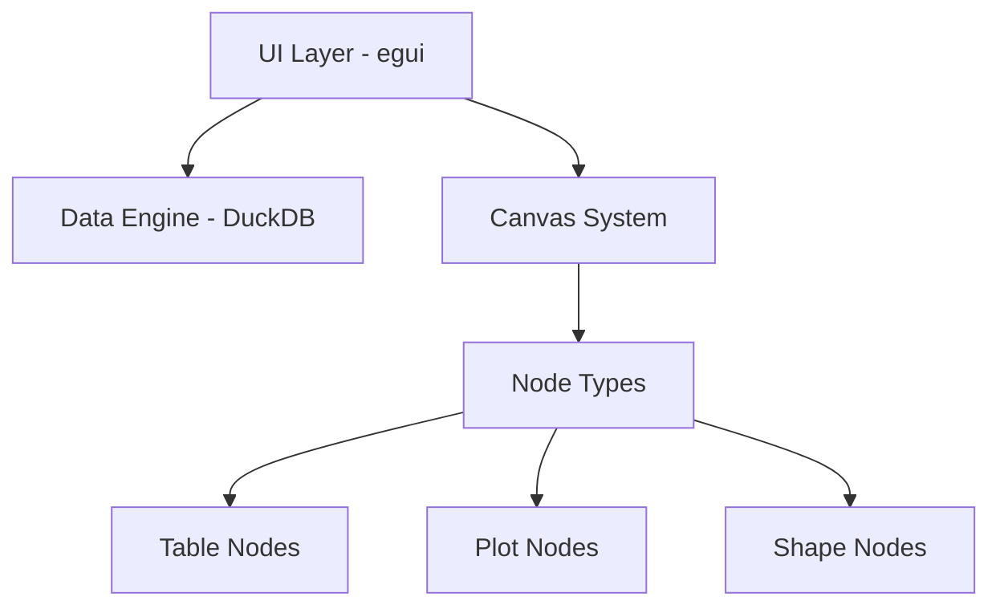

# Pika-Plot 🎨📊

A modern, canvas-based data visualization tool that combines the flexibility of drawing applications with powerful data analysis capabilities.

## Overview

Pika-Plot provides an interactive canvas where you can:
- Import and visualize data from multiple sources
- Create various plot types with drag-and-drop simplicity
- Annotate and draw directly on your analysis
- Connect data sources to multiple visualizations

## Key Features

### 🎯 Interactive Canvas
- **Paint-like drawing tools** - Rectangle, circle, line, freehand drawing, and text
- **Live preview** - See shapes as you draw them
- **Infinite canvas** - Pan and zoom to organize your analysis
- **Grid system** - Optional grid for alignment

### 📊 Data Visualization
- **10+ plot types**: Histogram, scatter, line, bar, box plot, violin, heatmap, correlation, time series, radar
- **Drag-and-drop workflow** - Double-click data sources to add to canvas
- **Visual connections** - Bezier curves show data flow
- **Live updates** - Plots update when data changes

### 📁 Data Management
- **Multiple formats**: CSV, TSV, JSON, Parquet
- **Table preview** - See your data directly on canvas
- **Query support** - Transform data with SQL (coming soon)
- **Large file handling** - Efficient processing of big datasets

## Installation

### From Source
```bash
# Clone the repository
git clone https://github.com/yourusername/pika-plot.git
cd pika-plot

# Build in release mode
cargo build --release

# Run the application
cargo run --release
```

### Requirements
- Rust 1.70 or higher
- Windows 10/11, macOS, or Linux
- OpenGL 3.3+ support

## Quick Start

1. **Launch Pika-Plot**
   ```bash
   cargo run --release
   ```

2. **Import Data**
   - Click "Import CSV" in the left panel
   - Or drag and drop files onto the application

3. **Create Visualizations**
   - Double-click a data source to add it to canvas
   - Right-click the table node and select "Add Plot"
   - Choose your visualization type

4. **Annotate**
   - Use drawing tools to highlight insights
   - Add text notes for explanations
   - Draw shapes to group related items

## Canvas Tools

| Tool | Shortcut | Description |
|------|----------|-------------|
| Select | S | Select and move items |
| Rectangle | R | Draw rectangles |
| Circle | C | Draw circles |
| Line | L | Draw straight lines |
| Draw | D | Freehand drawing |
| Text | T | Add text annotations |
| Pan | P | Pan the canvas view |

## Architecture



## Development

### Project Structure
```
pika-plot/
├── pika-ui/          # User interface
├── pika-engine/      # Data processing engine
├── pika-core/        # Core types and traits
├── pika-app/         # Main application
└── docs/             # Documentation
```

### Building from Source
```bash
# Debug build
cargo build

# Release build with optimizations
cargo build --release

# Run tests
cargo test

# Run with logging
RUST_LOG=debug cargo run
```

## Contributing

We welcome contributions! Please see our [Contributing Guide](CONTRIBUTING.md) for details.

### Areas for Contribution
- New plot types
- Data source connectors
- Canvas tools and features
- Performance optimizations
- Documentation improvements

## License

This project is licensed under the MIT License - see the [LICENSE](LICENSE) file for details.

## Acknowledgments

- Built with [egui](https://github.com/emilk/egui) for the UI
- Powered by [DuckDB](https://duckdb.org/) for data processing
- Inspired by tools like Excalidraw and Tableau

---

**Status**: Active Development 🚀

For questions, issues, or suggestions, please open an issue on GitHub. 