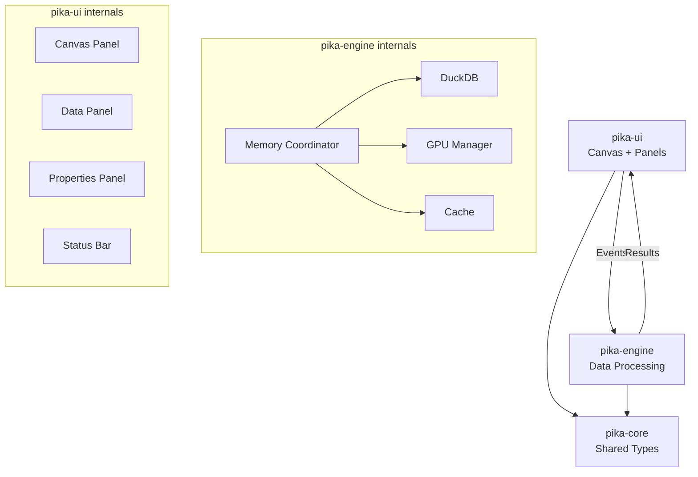

# Pika-Plot Architecture Summary

## 🎯 Vision Alignment

We're building **"Excalidraw for Gigabytes of Data"** - an infinite canvas where users can visually compose data pipelines, execute SQL queries, and see GPU-accelerated visualizations, all while handling gigabyte-scale datasets offline on Windows machines.

## 🏗️ Current Architecture



## ✅ What's Working

### Canvas (Infinite Workspace)
- **Pan**: Middle mouse drag
- **Zoom**: Scroll wheel (10%-500%)
- **Grid**: Visual reference that scales with zoom
- **Nodes**: Draggable data representations
- **Connections**: Bezier curves showing data flow

### Architecture Patterns (from frog-viz)
- **Tokio Runtime**: Async operations throughout
- **Event System**: UI ↔ Engine communication via channels
- **Memory Safety**: Arc<RwLock<>> for shared state

### UI Patterns (from pebble)
- **File Import**: Configuration dialog with type inference
- **Dark Theme**: Consistent visual style
- **Panels**: Resizable, collapsible UI sections

## 🚧 What's Missing (But Designed)

### 1. Breadcrumbs
```
Table → Query → Plot → Export
```
Designed but not implemented. Will show context trail.

### 2. GPU Rendering
Infrastructure exists but needs plot implementations from frog-viz.

### 3. SQL Execution
Engine has stubs, needs DuckDB query execution wired up.

## 🔄 Data Flow

1. **Import**: User drops CSV → ImportOptions → DuckDB table
2. **Query**: Node context menu → SQL → QueryResult  
3. **Visualize**: QueryResult → GPU buffers → Rendered plot
4. **Connect**: Drag between nodes → Pipeline creation
5. **Navigate**: Breadcrumbs show context → Click to jump

## 💾 Memory Management

Our unique **Memory Coordinator** unifies RAM and VRAM:
- 60/40 split between DuckDB and GPU
- Cost-based eviction (non-visible items first)
- Dynamic rebalancing based on pressure
- 2GB reserved for OS/other apps

## 🎨 UI Philosophy

Following the Excalidraw inspiration:
- **Spatial**: Position has meaning
- **Visual**: See connections, not just lists
- **Immediate**: Direct manipulation, no modes
- **Forgiving**: Easy undo, non-destructive

## 🚀 Performance Strategy

1. **Streaming**: Process data in chunks
2. **Caching**: Smart eviction based on visibility
3. **GPU Acceleration**: Not just rendering, but aggregation
4. **Progressive**: Show partial results quickly

## 🔍 Code Organization

```
pika-core/
  types.rs         # NodeId, ImportOptions, TableInfo
  events.rs        # AppEvent enum for communication
  
pika-engine/  
  lib.rs           # Main Engine struct
  query.rs         # SQL execution (TODO: wire up)
  gpu/             # GPU management and shaders
  memory_coordinator.rs  # Unified memory management
  
pika-ui/
  app.rs           # Main application loop
  panels/
    canvas.rs      # Infinite canvas implementation
    data.rs        # Data source list
    properties.rs  # Node properties
  state.rs         # Application state
```

## 🎯 Next Critical Steps

1. **Wire SQL**: Connect query.rs to actually execute
2. **Add Breadcrumbs**: Simple trail component
3. **Port Scatter Plot**: From frog-viz with GPU
4. **Test at Scale**: 1M point dataset

This gives us an MVP that demonstrates the vision! 