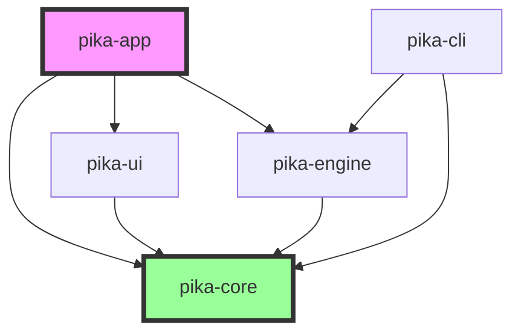
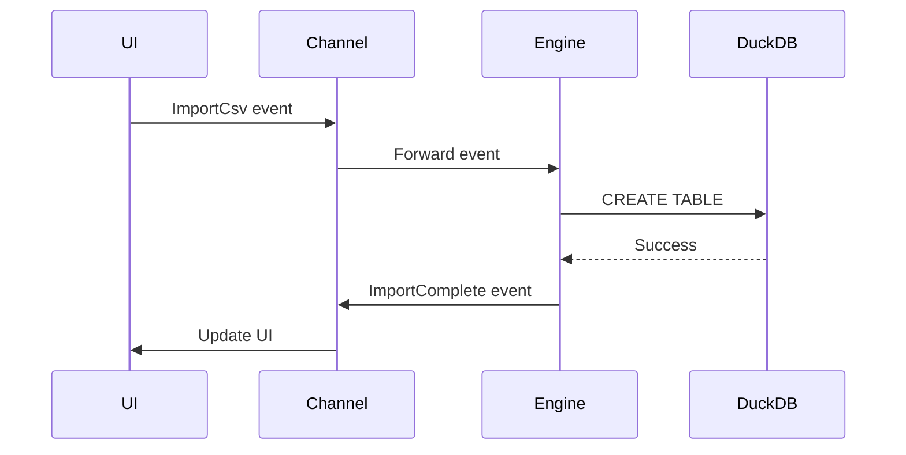
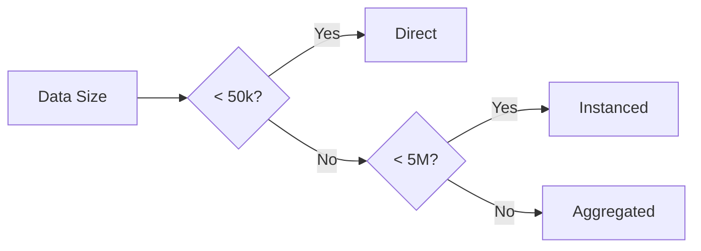

# 🏗️ Pika-Plot System Architecture

## Overview

Pika-Plot follows a modular, event-driven architecture with clear separation of concerns. The system is designed for high performance, maintainability, and extensibility while keeping complexity manageable.

## 🎯 Architectural Principles

1. **Separation of Concerns**: UI, engine, and data layers are completely decoupled
2. **Message Passing**: Components communicate via typed events, not shared state
3. **Single Responsibility**: Each crate has one clear purpose
4. **Fail-Fast**: Errors are surfaced immediately with helpful messages
5. **Performance by Design**: GPU acceleration and caching are first-class concerns

## 📦 Crate Architecture



### pika-core (Foundation Layer)
**Purpose**: Shared types, traits, and contracts

**Key Components**:
- Type definitions (NodeId, QueryResult, PlotConfig, etc.)
- Event enum for inter-component communication
- Error types with user-friendly messages
- Core traits (Node, MemoryMonitor)

**Dependencies**: Minimal - only serialization and utility crates

### pika-engine (Data Layer)
**Purpose**: All data processing, querying, and caching

**Key Components**:
- DuckDB integration for SQL queries
- CSV import with type inference
- Two-tier cache (queries + GPU buffers)
- Memory monitoring and management
- Async query execution

**Key Types**:
```rust
pub struct Engine {
    storage: StorageEngine,
    query_cache: QueryCache,
    plot_cache: PlotCache,
    memory_monitor: Arc<MemoryMonitor>,
}
```

**Threading Model**: Runs on dedicated Tokio runtime

### pika-ui (Presentation Layer)
**Purpose**: All user interface components and interactions

**Key Components**:
- Dual-mode workspace (Notebook + Canvas)
- Node implementations and rendering
- GPU plot rendering via wgpu
- Export dialogs and functionality
- Theme and styling

**Key Types**:
```rust
pub struct Workspace {
    mode: WorkspaceMode,
    gpu_renderer: GpuPlotRenderer,
    selected_nodes: HashSet<NodeId>,
}
```

### pika-app (Application Layer)
**Purpose**: Application lifecycle and orchestration

**Key Components**:
- Main window setup
- Event routing between UI and Engine
- Settings persistence
- Platform-specific code (Windows APIs)
- Crash handling and recovery

**Key Types**:
```rust
pub struct PikaPlotApp {
    runtime: AppRuntime,
    workspace: Workspace,
    settings: AppSettings,
}
```

### pika-cli (Alternative Entry Point)
**Purpose**: Command-line interface for headless operation

**Key Components**:
- Subcommands (ingest, query, plot, replay, stress)
- Direct engine API usage
- Batch processing support
- Testing utilities

## 🔄 Data Flow Architecture

### Event-Driven Communication



**Channel Architecture**:
- Single `mpsc` channel pair for bidirectional communication
- Bounded channels (size: 1000) to prevent memory issues
- Type-safe event enum ensures compile-time correctness

### Caching Architecture

**Two-Tier Cache Design**:

1. **Query Cache** (L1)
   - LRU cache using `moka` crate
   - Key: Normalized SQL query
   - Value: Arc<RecordBatch>
   - Size limit: 1GB or 100 entries

2. **Plot Cache** (L2)
   - GPU buffers for visible plots only
   - Key: NodeId
   - Value: GpuBuffer
   - Immediately dropped when plot hidden

**Cache Invalidation**:
- Query cache: Time-based (5 minutes) + manual clear
- Plot cache: Cleared on any data change

## 🖼️ GPU Rendering Architecture

### Three-Mode Rendering Pipeline

```rust
pub enum RenderMode {
    Direct,      // < 50k points
    Instanced,   // 50k - 5M points
    Aggregated,  // > 5M points
}
```

**Pipeline Selection**:


### GPU Resource Management

**Buffer Strategy**:
- Vertex buffers allocated on-demand
- Uniform buffers updated per frame
- Compute buffers for aggregation pre-allocated

**Memory Limits**:
- Track GPU memory usage via wgpu
- Fail fast if allocation would exceed 80% VRAM
- Clear least-recently-used buffers on pressure

## 🧠 Memory Management

### Monitoring Strategy

```rust
pub struct MemoryMonitor {
    warning_threshold: f64,  // 0.8 (80%)
    max_threshold: f64,      // 0.95 (95%)
}
```

**Actions by Threshold**:
- < 80%: Normal operation
- 80-95%: Show warning, continue operation
- > 95%: Reject new operations, suggest cleanup

### Windows-Specific Implementation

```rust
#[cfg(windows)]
fn available_memory() -> usize {
    use windows::Win32::System::SystemInformation::*;
    let mut status = MEMORYSTATUSEX::default();
    GlobalMemoryStatusEx(&mut status);
    status.ullAvailPhys as usize
}
```

## 🔐 Error Handling Strategy

### Error Propagation

```rust
// All operations return Result<T, PikaError>
pub async fn import_csv(path: &Path) -> Result<TableInfo, PikaError> {
    // Validate file exists
    if !path.exists() {
        return Err(PikaError::FileNotFound { path: path.to_owned() });
    }
    
    // Check file size
    let metadata = fs::metadata(path)?;
    if metadata.len() > MAX_FILE_SIZE {
        return Err(PikaError::FileTooLarge { ... });
    }
    
    // Proceed with import...
}
```

### User-Facing Error Display

```rust
impl PikaError {
    fn display_toast(&self, ui: &mut egui::Ui) {
        let (title, icon) = match self {
            PikaError::FileNotFound { .. } => ("File Not Found", "❌"),
            PikaError::InsufficientMemory { .. } => ("Low Memory", "⚠️"),
            _ => ("Error", "❗"),
        };
        
        ui.add(toast::Toast::error(title)
            .body(self.to_string())
            .action(self.suggested_action()));
    }
}
```

## 🔄 State Management

### UI State
- Managed locally in each component
- Immediate mode (egui) means state is re-evaluated each frame
- Persistent state saved to disk between sessions

### Engine State
- Encapsulated within Engine struct
- All mutations go through message passing
- No shared mutable state between threads

### Synchronization
- UI holds NodeId references
- Engine holds actual data
- Data requested on-demand via events

## 🚀 Performance Optimizations

### Lazy Evaluation
- Queries executed only when results needed
- Plots rendered only when visible
- Imports happen in background

### Parallelization
- CSV parsing uses rayon for parallel processing
- GPU compute shaders process millions of points in parallel
- Multiple queries can execute concurrently

### Memory Pooling
- Reuse GPU buffers when possible
- Arrow builders recycled for similar schemas
- Channel buffers pre-allocated

## 🔧 Extension Points

### Adding New Node Types

1. Define node data struct in `pika-core`
2. Implement Node trait
3. Add to NodeType enum
4. Update UI rendering in `pika-ui`
5. Handle in event processing

### Adding New Plot Types

1. Define plot config in PlotSpecificConfig
2. Implement GPU shaders
3. Add to plot type registry
4. Update UI configuration panel

### Adding New Export Formats

1. Define format in ExportFormat enum
2. Implement serialization logic
3. Add to export dialog
4. Update file extension handling

## 📊 Metrics and Monitoring

### Performance Metrics
- Frame time (target: 16.6ms)
- Query execution time
- Memory usage (RAM and VRAM)
- Cache hit rates

### Debug Overlays
- FPS counter
- Memory usage graph
- GPU utilization
- Event queue depth

## 🎯 Design Decisions and Rationale

### Why DuckDB?
- Excellent CSV parsing
- Full SQL support
- Columnar storage matches Arrow
- Embedded (no server needed)
- Great performance on analytical queries

### Why Two-Tier Cache?
- Query cache prevents re-execution
- GPU cache prevents re-upload
- Simple enough to reason about
- Easy to implement correctly

### Why Event-Driven?
- Clean separation of concerns
- Natural fit for UI/Engine split
- Easy to test in isolation
- Supports future distribution

### Why egui?
- Immediate mode is simple
- Excellent performance
- Good wgpu integration
- Active community
- Pure Rust

This architecture provides a solid foundation for building a high-performance data visualization tool while keeping complexity manageable and maintaining flexibility for future enhancements. 